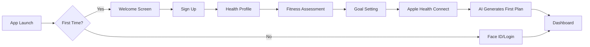
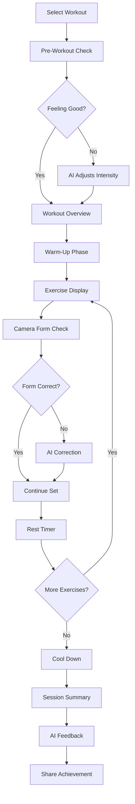
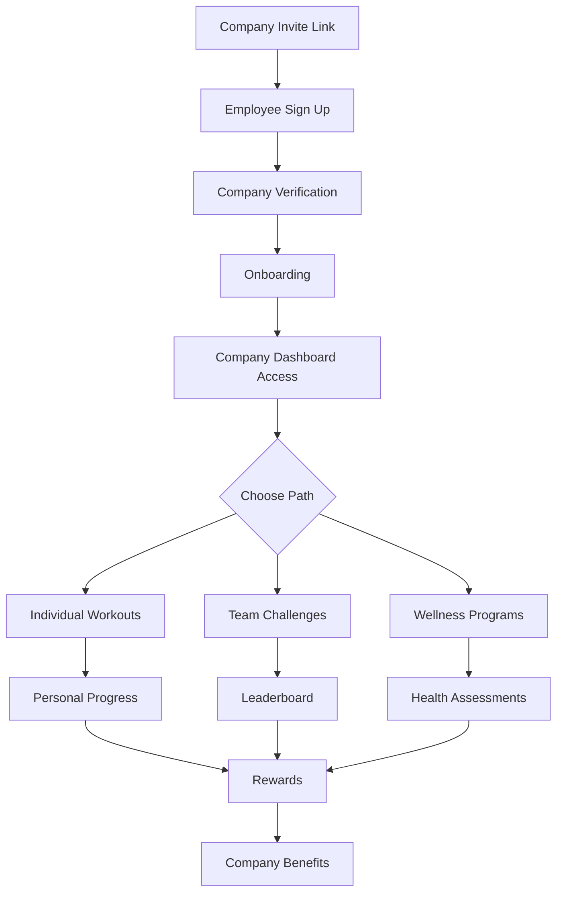

# Trainerly - AI-Powered Fitness Platform
## Product Requirements Document (PRD)

---

## 📋 Executive Summary

**Trainerly** is an AI-powered fitness and wellness platform designed to revolutionize the health industry across Europe, starting from Estonia. By integrating advanced machine learning, Apple Health ecosystem, and a multi-stakeholder approach, Trainerly creates a comprehensive fitness ecosystem serving enterprises, salons, personal trainers, and individual members.

### Vision Statement
To become Europe's leading AI-driven fitness platform, democratizing personalized health and wellness through intelligent technology while building a €1B+ valuation within 5 years.

### Mission
Empower every individual and business in the fitness ecosystem with AI-powered tools that make health optimization accessible, personalized, and measurable.

---

## 🎯 Needs, Goals & Pain Points

### Market Needs
- **Personalization Gap**: 73% of fitness app users abandon generic workout plans within 3 months
- **Business Management**: Fitness businesses lose 35% revenue due to inefficient scheduling and member management
- **Data Fragmentation**: Health data scattered across multiple platforms without actionable insights
- **Professional Tools**: Personal trainers lack sophisticated tools for client management and progress tracking

### User Goals

#### Members
- Achieve fitness goals with personalized, adaptive workout plans
- Track comprehensive health metrics in one place
- Access professional guidance affordably
- Maintain motivation through gamification and community

#### Personal Trainers
- Scale client base beyond physical limitations
- Automate program creation and adjustments
- Track client progress with AI insights
- Increase revenue through digital services

#### Salons/Studios
- Optimize class scheduling and capacity
- Reduce no-shows through intelligent reminders
- Increase member retention with personalized experiences
- Streamline payment and membership management

#### Enterprises
- Improve employee wellness and productivity
- Reduce healthcare costs through preventive fitness
- Track ROI on wellness programs
- Ensure GDPR-compliant health data management

### Pain Points & Solutions

| Pain Point | Trainerly Solution |
|------------|-------------------|
| Generic workout plans | AI-generated personalized programs based on goals, fitness level, and Apple Health data |
| Lack of motivation | Gamification, social challenges, and AI coach encouragement |
| Scheduling conflicts | Smart scheduling with AI predictions for optimal workout times |
| Progress plateau | ML-driven program adjustments to break through plateaus |
| High PT costs | Affordable AI coaching with optional human PT consultations |
| Business inefficiency | Automated admin tasks, smart scheduling, and member insights |

---

## 💡 Features & Modules

### Core AI/ML Features
- **Adaptive Workout Intelligence**: Real-time workout adjustments based on performance
- **Predictive Health Analytics**: Injury prevention and performance forecasting
- **Natural Language Coach**: Conversational AI for form corrections and motivation
- **Computer Vision**: Form analysis through device camera (iOS 17+ features)
- **Sentiment Analysis**: Mood-based workout recommendations

### Module 1: Member Application
- AI-personalized workout & nutrition plans
- Apple Health integration & comprehensive tracking
- Social features & challenges
- Progress analytics & insights
- Virtual AI coach with voice guidance
- Offline mode for workouts
- AR workout demonstrations (iOS ARKit)

### Module 2: Personal Trainer Platform
- Client management dashboard
- AI-assisted program builder
- Progress tracking & analytics
- Video consultation integration
- Payment processing & invoicing
- Content creation tools (workout videos, plans)
- Client acquisition tools

### Module 3: Salon/Studio Management
- Class scheduling & booking system
- Member check-in (QR/NFC)
- Capacity optimization AI
- Instructor management
- Equipment maintenance tracking
- Financial reporting & analytics
- Marketing automation

### Module 4: Enterprise Wellness
- Employee wellness dashboard
- Corporate challenge creation
- Health risk assessments
- ROI tracking & reporting
- Integration with corporate health insurance
- GDPR-compliant data handling
- Multi-location management

---

## 💰 Monetization Strategy

### Revenue Streams

#### B2C - Member Subscriptions
- **Free Tier**: Basic workouts, limited AI features
- **Pro** (€9.99/month): Full AI coaching, unlimited workouts, nutrition tracking
- **Elite** (€19.99/month): Personal trainer consultations, advanced analytics, priority support

#### B2B - Business Solutions
- **Trainer Pro** (€29.99/month): Full platform access for individual trainers
- **Studio** (€199/month): Up to 100 members, full management suite
- **Studio Plus** (€499/month): Unlimited members, multi-location, API access
- **Enterprise** (Custom pricing): Full customization, dedicated support, SLA

#### Additional Revenue
- Transaction fees (3% on PT bookings)
- Marketplace commission (20% on digital products)
- Premium content partnerships
- Corporate wellness contracts
- White-label solutions
- API access for third-party developers

### Projected Revenue (5-Year)
- Year 1: €500K (1,000 paying users)
- Year 2: €2.5M (8,000 paying users)
- Year 3: €10M (30,000 paying users, 100 businesses)
- Year 4: €35M (100,000 paying users, 500 businesses)
- Year 5: €100M+ (300,000 paying users, 2,000 businesses, enterprise contracts)

---

## 🛠 Technology Stack

### Backend Infrastructure
- **Runtime**: Node.js 20+ with TypeScript
- **Framework**: NestJS (microservices architecture)
- **API**: GraphQL (Apollo Server) + REST endpoints
- **Queue**: Bull MQ with Redis
- **Real-time**: WebSockets (Socket.io)
- **Authentication**: Auth0 with biometric support

### Database (Supabase)
- **Primary DB**: PostgreSQL (via Supabase)
- **Real-time subscriptions**: Supabase Realtime
- **File Storage**: Supabase Storage (workout videos, images)
- **Vector DB**: pgvector for AI embeddings
- **Caching**: Redis
- **Time-series**: TimescaleDB for fitness metrics

### Frontend (iOS)
- **Framework**: SwiftUI + UIKit hybrid
- **Architecture**: MVVM with Combine
- **Networking**: URLSession + Apollo iOS
- **Storage**: Core Data + CloudKit sync
- **Health**: HealthKit, CareKit
- **AR/ML**: ARKit, Core ML, Vision framework
- **Analytics**: Firebase Analytics
- **Push**: Apple Push Notification Service

### AI/ML Services
- **Primary LLM**: OpenAI GPT-4o for conversational AI
- **Vision**: Google Gemini Pro Vision for form analysis
- **Custom Models**: TensorFlow Lite for on-device inference
- **Embeddings**: OpenAI Ada for semantic search
- **Speech**: Apple Speech framework for voice coaching

### Infrastructure & DevOps
- **Cloud**: AWS (EU regions for GDPR compliance)
- **CDN**: CloudFlare
- **CI/CD**: GitHub Actions
- **Monitoring**: Datadog, Sentry
- **Container**: Docker + Kubernetes (EKS)

### API Integrations
- **Payment**: Stripe (EU payments)
- **Calendar**: Google Calendar, Outlook
- **Wearables**: Apple Watch, Garmin Connect
- **Video**: Agora.io for live classes
- **Email**: SendGrid
- **SMS**: Twilio

---

## 🎮 Gamification & Engagement

### Core Mechanics
- **XP System**: Earn points for workouts, consistency, challenges
- **Levels**: 50 levels with increasing benefits
- **Badges**: 100+ achievement badges (First 5K, 30-Day Streak, etc.)
- **Leaderboards**: Global, friends, company, studio
- **Challenges**: Daily, weekly, seasonal events
- **Streaks**: Workout consistency tracking with rewards

### Social Features
- **Teams**: Create or join fitness teams
- **Competitions**: Inter-company, inter-studio challenges
- **Social Feed**: Share achievements, PRs, transformations
- **Kudos System**: Encourage other members
- **Mentorship**: Higher-level users can mentor beginners

### Rewards
- **Virtual**: Badges, titles, avatar customization
- **Discounts**: Partner brand discounts based on activity
- **Premium Features**: Unlock features through achievements
- **Real Rewards**: Monthly draws for fitness gear

---

## 📊 KPIs & Success Metrics

### User Metrics
- Monthly Active Users (MAU)
- Daily Active Users (DAU)
- User retention (D1, D7, D30, D90)
- Workout completion rate
- Average session duration
- User lifetime value (LTV)
- Customer Acquisition Cost (CAC)

### Business Metrics
- Monthly Recurring Revenue (MRR)
- Annual Recurring Revenue (ARR)
- Gross margin
- Churn rate (<5% monthly target)
- Net Promoter Score (NPS >50)
- Conversion rate (free to paid)

### Health Impact Metrics
- Average fitness level improvement
- Injury reduction rate
- Member weight loss/muscle gain goals achieved
- Corporate wellness ROI

### Platform Metrics
- API response time (<200ms)
- Uptime (99.9% SLA)
- AI recommendation accuracy
- App store rating (>4.5 stars)

---

## 🗺 Product Roadmap

### Phase 1: MVP (Months 1-3)
**Goal**: Launch core member app with basic AI features

- Basic workout library with AI recommendations
- Apple Health integration
- User authentication & profiles
- Simple progress tracking
- Basic gamification (XP, levels)
- Free + Pro tier implementation

### Phase 2: AI Enhancement (Months 4-6)
**Goal**: Advanced AI features & trainer module

- GPT-4 powered AI coach
- Computer vision form checking
- Personal trainer platform launch
- Video consultations
- Advanced analytics dashboard
- Social features & challenges

### Phase 3: Business Expansion (Months 7-9)
**Goal**: Launch salon/studio management

- Studio management system
- Class scheduling & booking
- Multi-location support
- Payment processing
- Marketing automation
- Equipment tracking

### Phase 4: Enterprise & Scale (Months 10-12)
**Goal**: Enterprise module & European expansion

- Enterprise wellness platform
- Corporate challenges
- GDPR compliance certification
- Multi-language support (10 languages)
- API marketplace
- White-label options

### Phase 5: Innovation (Year 2)
**Goal**: Cutting-edge features & market leadership

- AR workout experiences
- VR fitness classes
- Genetic testing integration
- Insurance partnerships
- Franchise model
- IPO preparation

---

## ⚠️ Risk Assessment & Mitigation

### Technical Risks
| Risk | Impact | Mitigation |
|------|--------|------------|
| AI model accuracy | High | Continuous training, human oversight, feedback loops |
| Data breach | Critical | End-to-end encryption, security audits, insurance |
| Scalability issues | High | Microservices, auto-scaling, load testing |
| Apple Health changes | Medium | Abstraction layer, multiple data sources |

### Business Risks
| Risk | Impact | Mitigation |
|------|--------|------------|
| Competition from big tech | High | Focus on B2B, local partnerships, superior UX |
| Regulatory changes | Medium | Legal counsel, compliance team, flexible architecture |
| Market saturation | Medium | Unique AI features, B2B focus, international expansion |
| Funding challenges | High | Revenue-first approach, strategic partnerships |

### Mitigation Strategies
- **Insurance**: Cyber liability, professional indemnity
- **Legal**: GDPR compliance from day 1
- **Technical**: 99.9% uptime SLA, disaster recovery
- **Business**: Diversified revenue streams
- **Team**: Hire experienced fitness tech professionals

---

## 📁 Project Structure

```
trainerly/
├── apps/
│   ├── ios-member/          # Member iOS app
│   ├── ios-trainer/         # Trainer iOS app
│   ├── web-dashboard/       # Business dashboard
│   └── admin-portal/        # Internal admin
├── services/
│   ├── auth-service/        # Authentication
│   ├── workout-service/     # Workout management
│   ├── ai-service/          # AI/ML processing
│   ├── payment-service/     # Stripe integration
│   ├── notification-service/# Push, email, SMS
│   └── analytics-service/   # Data analytics
├── packages/
│   ├── shared-types/        # TypeScript types
│   ├── ui-components/       # Shared UI
│   └── utils/              # Common utilities
├── infrastructure/
│   ├── terraform/          # Infrastructure as code
│   ├── k8s/               # Kubernetes configs
│   └── docker/            # Docker files
└── docs/                  # Documentation
```

---

## ✅ Implementation Checklist

### Pre-Development
- [ ] Finalize technical architecture
- [ ] Set up Supabase project
- [ ] Configure Apple Developer account
- [ ] Set up Stripe account (EU)
- [ ] Establish GitHub organization
- [ ] Create design system
- [ ] Hire core team (CTO, iOS dev, AI engineer)

### MVP Development (Month 1)
- [ ] User authentication system
- [ ] Basic workout database
- [ ] Apple Health integration
- [ ] User profile management
- [ ] Basic AI recommendation engine
- [ ] Payment integration

### MVP Development (Month 2)
- [ ] Workout tracking features
- [ ] Progress analytics
- [ ] Push notifications
- [ ] Basic gamification
- [ ] Social features foundation
- [ ] Performance optimization

### MVP Development (Month 3)
- [ ] AI coach implementation
- [ ] Beta testing program
- [ ] App Store submission
- [ ] Marketing website
- [ ] Documentation
- [ ], Launch preparation

### Post-Launch
- [ ] User feedback integration
- [ ] Performance monitoring
- [ ] A/B testing framework
- [ ] Content partnerships
- [ ] Trainer onboarding
- [ ] Studio partnerships

---

## 🚀 Action Plan

### Immediate Actions (Week 1-2)
1. Finalize technical specifications
2. Set up development environment
3. Create investor pitch deck
4. Apply for Estonia e-Residency
5. Register Estonian company
6. Open business bank account

### Short-term (Month 1)
1. Hire founding technical team
2. Begin MVP development
3. Establish key partnerships
4. Create brand identity
5. Set up legal structure
6. Apply for initial funding

### Medium-term (Months 2-3)
1. Complete MVP development
2. Begin beta testing
3. Iterate based on feedback
4. Prepare App Store launch
5. Develop go-to-market strategy
6. Secure seed funding

### Launch Strategy
1. Soft launch in Estonia
2. Gather user feedback
3. Iterate and improve
4. Expand to Baltic states
5. Scale across EU
6. Consider Series A funding

---

## 🏆 Unicorn Potential

### Why Trainerly Can Reach €1B+ Valuation

1. **Market Size**: EU fitness market worth €30B+ annually
2. **Scalability**: Software margins of 80%+ at scale
3. **Network Effects**: More users = better AI = more value
4. **Platform Play**: Multiple revenue streams and stakeholders
5. **AI Moat**: Proprietary data and models improve over time
6. **B2B2C Model**: Captures value across entire ecosystem
7. **Health Megatrend**: Preventive health focus post-COVID
8. **Exit Opportunities**: Acquisition targets for Apple, Google, Peloton

### Success Indicators
- 300K+ paying users achievable in 5 years
- €100M ARR run rate by year 5
- 10-15x revenue multiple for SaaS + AI
- Strategic value to health tech acquirers
- Platform extensibility to new markets

---

## 📞 Contact & Next Steps

**Project Lead**: [Your Name]  
**Location**: Tallinn, Estonia  
**Email**: [Your Email]  
**LinkedIn**: [Your LinkedIn]

### Estonia Startup Visa Benefits
- Access to EU market (450M+ consumers)
- Favorable tax regime (0% on reinvested profits)
- Digital infrastructure (#1 in Europe)
- Strong tech talent pool
- Government support for startups
- Easy expansion to Nordic markets

### Call to Action
Trainerly represents a unique opportunity to build Europe's leading AI-powered fitness platform from Estonia. With its innovative technology, scalable business model, and massive market potential, Trainerly is positioned to become Estonia's next unicorn success story.

---

## 🎨 UX Architecture & User Flows

### Information Architecture

```
Trainerly App Structure
│
├── Onboarding Flow
│   ├── Welcome Screen
│   ├── Sign Up / Login
│   ├── Health Profile Setup
│   ├── Goal Setting
│   ├── Apple Health Permissions
│   └── Personalization Quiz
│
├── Main Navigation (Tab Bar)
│   ├── Home Dashboard
│   │   ├── Today's Workout
│   │   ├── AI Coach Messages
│   │   ├── Quick Stats
│   │   └── Upcoming Sessions
│   │
│   ├── Workouts
│   │   ├── AI Recommended
│   │   ├── Browse Library
│   │   ├── Custom Workouts
│   │   ├── Live Classes
│   │   └── Saved Workouts
│   │
│   ├── Progress
│   │   ├── Analytics Dashboard
│   │   ├── Body Metrics
│   │   ├── Performance Trends
│   │   ├── Achievement Gallery
│   │   └── Health Insights
│   │
│   ├── Social
│   │   ├── Feed
│   │   ├── Challenges
│   │   ├── Leaderboards
│   │   ├── Teams
│   │   └── Messages
│   │
│   └── Profile
│       ├── Settings
│       ├── Subscription
│       ├── Trainer Access
│       ├── Health Data
│       └── Support
│
└── Context-Specific Flows
    ├── Workout Session
    ├── AI Coach Chat
    ├── Form Analysis Camera
    ├── Challenge Creation
    └── Trainer Booking
```

### Core User Flows

#### Flow 1: New User Onboarding


**Screens Description:**
1. **Welcome**: Hero image, value props, Sign Up/Login CTAs
2. **Sign Up**: Email, password, or Sign in with Apple
3. **Health Profile**: Age, weight, height, medical conditions
4. **Assessment**: Current fitness level quiz (beginner to athlete)
5. **Goals**: Multiple selection (weight loss, muscle, endurance, wellness)
6. **Permissions**: Apple Health access with benefits explanation
7. **AI Planning**: Loading animation while AI creates personalized plan
8. **Dashboard**: Personalized home with first workout ready

#### Flow 2: AI-Powered Workout Session


**Key Screens:**
- **Pre-Workout**: Mood/energy check, recent recovery data
- **Exercise Display**: Video demo, timer, reps counter, form tips
- **Form Check**: Camera view with overlay guides
- **AI Correction**: Real-time feedback bubbles
- **Summary**: Calories, duration, PRs, XP earned

#### Flow 3: Personal Trainer Interaction

```mermaid
graph LR
    A[Browse Trainers] --> B[Filter/Search]
    B --> C[Trainer Profile]
    C --> D[Check Availability]
    D --> E[Book Session]
    E --> F[Payment]
    F --> G[Confirmation]
    G --> H[Add to Calendar]
    H --> I[Session Reminder]
    I --> J[Video Session]
    J --> K[Post-Session]
    K --> L[Rate & Review]
    L --> M[Follow-up Plan]
```


#### Flow 4: Enterprise Employee Wellness


### Mobile-First Design Principles

#### Navigation Patterns
- **Tab Bar**: 5 main sections always accessible
- **Gesture Controls**: Swipe between workout exercises
- **Pull to Refresh**: Update dashboard data
- **3D Touch**: Quick actions from app icon
- **Haptic Feedback**: Confirm actions and milestones

#### Visual Hierarchy
1. **Primary Actions**: Large, thumb-reachable buttons
2. **AI Coach**: Floating action button for quick access
3. **Progress Indicators**: Visual rings and charts
4. **Cards**: Swipeable workout and challenge cards

#### Responsive Layouts
- **iPhone SE to Pro Max**: Adaptive layouts
- **iPad**: Multi-column dashboard
- **Apple Watch**: Companion app for tracking
- **Landscape Mode**: Video playback optimized

### Accessibility Features
- **VoiceOver**: Full screen reader support
- **Dynamic Type**: Scalable text
- **High Contrast**: Alternative color schemes
- **Reduce Motion**: Simplified animations
- **Voice Commands**: Siri integration

---

## 💻 Code Examples

### 1. AI Workout Generation Service (Node.js/TypeScript)

```typescript
// services/ai-service/src/workout-generator.ts
import { OpenAI } from 'openai';
import { SupabaseClient } from '@supabase/supabase-js';
import { Redis } from 'ioredis';

interface UserProfile {
  id: string;
  fitnessLevel: 'beginner' | 'intermediate' | 'advanced' | 'athlete';
  goals: string[];
  restrictions: string[];
  equipment: string[];
  preferredDuration: number;
  recentWorkouts: Workout[];
  healthMetrics: HealthData;
}

interface Workout {
  id: string;
  name: string;
  exercises: Exercise[];
  duration: number;
  difficulty: number;
  targetMuscles: string[];
  caloriesBurn: number;
}

export class AIWorkoutGenerator {
  private openai: OpenAI;
  private supabase: SupabaseClient;
  private redis: Redis;
  
  constructor(openaiKey: string, supabaseUrl: string, supabaseKey: string) {
    this.openai = new OpenAI({ apiKey: openaiKey });
    this.supabase = createClient(supabaseUrl, supabaseKey);
    this.redis = new Redis();
  }

  async generatePersonalizedWorkout(userId: string): Promise<Workout> {
    // Check cache first
    const cached = await this.redis.get(`workout:${userId}:${new Date().toDateString()}`);
    if (cached) return JSON.parse(cached);

    // Fetch user profile and health data
    const userProfile = await this.fetchUserProfile(userId);
    const recentPerformance = await this.analyzeRecentPerformance(userId);
    
    // Generate workout using GPT-4
    const prompt = this.buildWorkoutPrompt(userProfile, recentPerformance);
    
    const completion = await this.openai.chat.completions.create({
      model: "gpt-4-turbo-preview",
      messages: [
        {
          role: "system",
          content: `You are an expert fitness coach AI. Generate personalized workouts based on user data.
                   Return response in JSON format with exercises, sets, reps, and rest periods.`
        },
        {
          role: "user",
          content: prompt
        }
      ],
      response_format: { type: "json_object" },
      temperature: 0.7,
      max_tokens: 2000
    });

    const workoutPlan = JSON.parse(completion.choices[0].message.content);
    
    // Enhance with exercise videos and form tips
    const enhancedWorkout = await this.enhanceWorkoutWithMedia(workoutPlan);
    
    // Apply adaptive difficulty based on recent performance
    const adaptedWorkout = this.applyAdaptiveDifficulty(enhancedWorkout, recentPerformance);
    
    // Store in database
    await this.saveWorkout(userId, adaptedWorkout);
    
    // Cache for today
    await this.redis.setex(
      `workout:${userId}:${new Date().toDateString()}`,
      86400,
      JSON.stringify(adaptedWorkout)
    );
    
    return adaptedWorkout;
  }

  private async analyzeRecentPerformance(userId: string): Promise<PerformanceMetrics> {
    const { data: sessions } = await this.supabase
      .from('workout_sessions')
      .select('*')
      .eq('user_id', userId)
      .order('completed_at', { ascending: false })
      .limit(10);
    
    // Calculate performance trends
    const avgCompletion = sessions.reduce((acc, s) => acc + s.completion_rate, 0) / sessions.length;
    const avgDifficulty = sessions.reduce((acc, s) => acc + s.perceived_difficulty, 0) / sessions.length;
    const muscleRecovery = this.calculateMuscleRecovery(sessions);
    
    return {
      completionRate: avgCompletion,
      difficultyTrend: avgDifficulty,
      recoveryStatus: muscleRecovery,
      lastWorkoutDate: sessions[0]?.completed_at
    };
  }

  private applyAdaptiveDifficulty(workout: Workout, performance: PerformanceMetrics): Workout {
    const adjustmentFactor = this.calculateAdjustmentFactor(performance);
    
    return {
      ...workout,
      exercises: workout.exercises.map(exercise => ({
        ...exercise,
        sets: Math.round(exercise.sets * adjustmentFactor),
        reps: Math.round(exercise.reps * adjustmentFactor),
        weight: exercise.weight * adjustmentFactor,
        restTime: exercise.restTime / adjustmentFactor
      }))
    };
  }
}
```

### 2. iOS SwiftUI Workout Session View

```swift
// iOS/Trainerly/Views/WorkoutSessionView.swift
import SwiftUI
import HealthKit
import AVFoundation
import Vision

struct WorkoutSessionView: View {
    @StateObject private var viewModel = WorkoutSessionViewModel()
    @StateObject private var formAnalyzer = FormAnalyzer()
    @State private var currentExercise: Exercise?
    @State private var showFormCheck = false
    @State private var workoutState: WorkoutState = .notStarted
    
    let workout: Workout
    
    var body: some View {
        ZStack {
            // Background gradient
            LinearGradient(
                colors: [Color("PrimaryDark"), Color("PrimaryLight")],
                startPoint: .topLeading,
                endPoint: .bottomTrailing
            )
            .ignoresSafeArea()
            
            VStack(spacing: 0) {
                // Top Progress Bar
                WorkoutProgressBar(
                    progress: viewModel.overallProgress,
                    timeElapsed: viewModel.timeElapsed
                )
                .padding(.horizontal)
                
                // Main Exercise Display
                if let exercise = currentExercise {
                    ExerciseCard(
                        exercise: exercise,
                        currentSet: viewModel.currentSet,
                        currentRep: viewModel.currentRep,
                        onFormCheck: { showFormCheck = true }
                    )
                    .padding()
                    .transition(.asymmetric(
                        insertion: .move(edge: .trailing),
                        removal: .move(edge: .leading)
                    ))
                }
                
                // AI Coach Feedback
                if let feedback = viewModel.aiFeedback {
                    AICoachBubble(message: feedback)
                        .padding(.horizontal)
                        .transition(.scale.combined(with: .opacity))
                }
                
                // Control Buttons
                WorkoutControlPanel(
                    state: workoutState,
                    onStart: startWorkout,
                    onPause: pauseWorkout,
                    onSkip: skipExercise,
                    onEnd: endWorkout
                )
                .padding()
            }
        }
        .sheet(isPresented: $showFormCheck) {
            FormAnalysisView(
                exercise: currentExercise!,
                onComplete: { formScore in
                    viewModel.recordFormScore(formScore)
                    showFormCheck = false
                }
            )
        }
        .onAppear {
            viewModel.loadWorkout(workout)
            requestHealthKitPermissions()
        }
    }
    
    private func startWorkout() {
        workoutState = .active
        viewModel.startWorkout()
        startHealthKitSession()
    }
    
    private func startHealthKitSession() {
        let configuration = HKWorkoutConfiguration()
        configuration.activityType = .functionalStrengthTraining
        configuration.locationType = .indoor
        
        viewModel.healthStore.startWorkoutSession(configuration: configuration)
    }
}

// MARK: - Form Analysis with Vision
class FormAnalyzer: NSObject, ObservableObject {
    @Published var bodyPoints: [VNHumanBodyPoseObservation.JointName: CGPoint] = [:]
    @Published var formScore: Float = 0
    @Published var corrections: [String] = []
    
    private var videoCapture: AVCaptureSession?
    private let visionQueue = DispatchQueue(label: "com.trainerly.vision")
    
    func startAnalysis() {
        setupVideoCapture()
        startPoseDetection()
    }
    
    private func setupVideoCapture() {
        videoCapture = AVCaptureSession()
        videoCapture?.sessionPreset = .high
        
        guard let camera = AVCaptureDevice.default(.builtInWideAngleCamera, for: .video, position: .front),
              let input = try? AVCaptureDeviceInput(device: camera) else { return }
        
        videoCapture?.addInput(input)
        
        let output = AVCaptureVideoDataOutput()
        output.setSampleBufferDelegate(self, queue: visionQueue)
        videoCapture?.addOutput(output)
        
        videoCapture?.startRunning()
    }
    
    private func startPoseDetection() {
        let request = VNDetectHumanBodyPoseRequest { [weak self] request, error in
            guard let observations = request.results as? [VNHumanBodyPoseObservation],
                  let observation = observations.first else { return }
            
            self?.processPoseObservation(observation)
        }
        
        // Process video frames with Vision request
    }
    
    private func processPoseObservation(_ observation: VNHumanBodyPoseObservation) {
        // Extract key body points
        let joints: [VNHumanBodyPoseObservation.JointName] = [
            .nose, .leftShoulder, .rightShoulder,
            .leftElbow, .rightElbow, .leftWrist, .rightWrist,
            .leftHip, .rightHip, .leftKnee, .rightKnee,
            .leftAnkle, .rightAnkle
        ]
        
        var points: [VNHumanBodyPoseObservation.JointName: CGPoint] = [:]
        
        for joint in joints {
            if let point = try? observation.recognizedPoint(joint),
               point.confidence > 0.3 {
                points[joint] = CGPoint(x: point.location.x, y: 1 - point.location.y)
            }
        }
        
        DispatchQueue.main.async {
            self.bodyPoints = points
            self.calculateFormScore(from: points)
        }
    }
    
    private func calculateFormScore(from points: [VNHumanBodyPoseObservation.JointName: CGPoint]) {
        // Implement form scoring algorithm based on exercise type
        // Check angles, alignment, range of motion
        var score: Float = 100
        var issues: [String] = []
        
        // Example: Check squat depth
        if let leftHip = points[.leftHip],
           let leftKnee = points[.leftKnee],
           let leftAnkle = points[.leftAnkle] {
            
            let kneeAngle = calculateAngle(leftHip, leftKnee, leftAnkle)
            
            if kneeAngle > 90 {
                score -= 20
                issues.append("Go deeper - aim for 90° knee angle")
            }
        }
        
        // Check spine alignment
        if let nose = points[.nose],
           let leftShoulder = points[.leftShoulder],
           let rightShoulder = points[.rightShoulder] {
            
            let shoulderLine = CGPoint(
                x: (leftShoulder.x + rightShoulder.x) / 2,
                y: (leftShoulder.y + rightShoulder.y) / 2
            )
            
            let spineAlignment = abs(nose.x - shoulderLine.x)
            if spineAlignment > 0.1 {
                score -= 15
                issues.append("Keep your head aligned with spine")
            }
        }
        
        self.formScore = score
        self.corrections = issues
    }
}
```

### 3. Real-time Synchronization with Supabase

```typescript
// services/realtime-sync/src/workout-sync.ts
import { createClient, RealtimeChannel } from '@supabase/supabase-js';
import { EventEmitter } from 'events';

interface WorkoutSession {
  id: string;
  userId: string;
  workoutId: string;
  startTime: Date;
  exercises: ExerciseProgress[];
  heartRate: number[];
  calories: number;
  isLive: boolean;
}

interface ExerciseProgress {
  exerciseId: string;
  setsCompleted: number;
  repsPerSet: number[];
  weightUsed: number[];
  formScore: number[];
  restTime: number[];
}

export class WorkoutRealtimeSync extends EventEmitter {
  private supabase: SupabaseClient;
  private channel: RealtimeChannel;
  private sessionId: string;
  private syncInterval: NodeJS.Timeout;
  
  constructor(supabaseUrl: string, supabaseKey: string) {
    super();
    this.supabase = createClient(supabaseUrl, supabaseKey);
  }

  async startSession(userId: string, workoutId: string): Promise<string> {
    // Create new workout session
    const { data, error } = await this.supabase
      .from('workout_sessions')
      .insert({
        user_id: userId,
        workout_id: workoutId,
        start_time: new Date().toISOString(),
        is_live: true,
        status: 'active'
      })
      .select()
      .single();
    
    if (error) throw error;
    
    this.sessionId = data.id;
    
    // Subscribe to real-time updates
    this.setupRealtimeSubscription();
    
    // Start periodic sync
    this.startPeriodicSync();
    
    // Notify trainer if assigned
    await this.notifyTrainer(userId, this.sessionId);
    
    return this.sessionId;
  }

  private setupRealtimeSubscription() {
    this.channel = this.supabase
      .channel(`workout:${this.sessionId}`)
      .on(
        'postgres_changes',
        {
          event: '*',
          schema: 'public',
          table: 'workout_sessions',
          filter: `id=eq.${this.sessionId}`
        },
        (payload) => {
          this.handleRealtimeUpdate(payload);
        }
      )
      .on('presence', { event: 'sync' }, () => {
        const state = this.channel.presenceState();
        this.emit('viewers', Object.keys(state).length);
      })
      .subscribe();
  }

  async updateExerciseProgress(exerciseId: string, progress: Partial<ExerciseProgress>) {
    // Update in database
    const { error } = await this.supabase
      .from('exercise_progress')
      .upsert({
        session_id: this.sessionId,
        exercise_id: exerciseId,
        ...progress,
        updated_at: new Date().toISOString()
      });
    
    if (error) {
      console.error('Failed to update progress:', error);
      // Store locally for retry
      this.queueForRetry({ exerciseId, progress });
    }
    
    // Broadcast to connected clients
    this.channel.send({
      type: 'broadcast',
      event: 'exercise_update',
      payload: { exerciseId, progress }
    });
  }

  async syncHealthData(heartRate: number, calories: number) {
    const { error } = await this.supabase
      .from('health_metrics')
      .insert({
        session_id: this.sessionId,
        heart_rate: heartRate,
        calories_burned: calories,
        timestamp: new Date().toISOString()
      });
    
    if (!error) {
      // Update session aggregates
      await this.updateSessionAggregates(heartRate, calories);
    }
  }

  private async updateSessionAggregates(heartRate: number, calories: number) {
    // Use Supabase Edge Function for complex calculations
    const { data, error } = await this.supabase.functions.invoke('calculate-workout-metrics', {
      body: {
        sessionId: this.sessionId,
        heartRate,
        calories
      }
    });
    
    if (data) {
      this.emit('metrics_updated', data);
    }
  }

  private startPeriodicSync() {
    this.syncInterval = setInterval(async () => {
      // Sync Apple Health data
      const healthData = await this.fetchLatestHealthData();
      if (healthData) {
        await this.syncHealthData(healthData.heartRate, healthData.calories);
      }
      
      // Check connection status
      if (!this.channel.socket.isConnected()) {
        this.reconnect();
      }
    }, 5000); // Sync every 5 seconds
  }

  async endSession(summary: WorkoutSummary) {
    clearInterval(this.syncInterval);
    
    // Final update
    await this.supabase
      .from('workout_sessions')
      .update({
        end_time: new Date().toISOString(),
        is_live: false,
        status: 'completed',
        summary
      })
      .eq('id', this.sessionId);
    
    // Generate AI insights
    const insights = await this.generateAIInsights();
    
    // Store insights
    await this.supabase
      .from('workout_insights')
      .insert({
        session_id: this.sessionId,
        insights,
        generated_at: new Date().toISOString()
      });
    
    // Cleanup
    this.channel.unsubscribe();
    
    return insights;
  }

  private async generateAIInsights(): Promise<WorkoutInsights> {
    // Fetch session data
    const { data: sessionData } = await this.supabase
      .from('workout_sessions')
      .select(`
        *,
        exercise_progress (*),
        health_metrics (*)
      `)
      .eq('id', this.sessionId)
      .single();
    
    // Call AI service for insights
    const response = await fetch('https://api.openai.com/v1/chat/completions', {
      method: 'POST',
      headers: {
        'Authorization': `Bearer ${process.env.OPENAI_API_KEY}`,
        'Content-Type': 'application/json'
      },
      body: JSON.stringify({
        model: 'gpt-4-turbo-preview',
        messages: [
          {
            role: 'system',
            content: 'Analyze workout data and provide personalized insights and recommendations.'
          },
          {
            role: 'user',
            content: JSON.stringify(sessionData)
          }
        ]
      })
    });
    
    const aiResponse = await response.json();
    return JSON.parse(aiResponse.choices[0].message.content);
  }
}
```

### 4. Gamification Engine

```typescript
// services/gamification/src/achievement-engine.ts
import { SupabaseClient } from '@supabase/supabase-js';
import { Redis } from 'ioredis';

interface Achievement {
  id: string;
  name: string;
  description: string;
  category: 'workout' | 'social' | 'milestone' | 'challenge';
  points: number;
  badge: string;
  requirements: AchievementRequirement[];
}

interface AchievementRequirement {
  type: 'count' | 'streak' | 'total' | 'specific';
  metric: string;
  value: number;
  timeframe?: 'day' | 'week' | 'month' | 'all-time';
}

export class GamificationEngine {
  private supabase: SupabaseClient;
  private redis: Redis;
  private achievements: Map<string, Achievement>;
  
  constructor(supabase: SupabaseClient, redis: Redis) {
    this.supabase = supabase;
    this.redis = redis;
    this.achievements = new Map();
    this.loadAchievements();
  }

  async processWorkoutCompletion(userId: string, sessionId: string) {
    const userStats = await this.getUserStats(userId);
    const session = await this.getSessionData(sessionId);
    
    // Update user stats
    const updatedStats = await this.updateUserStats(userId, session);
    
    // Check for new achievements
    const newAchievements = await this.checkAchievements(userId, updatedStats);
    
    // Award XP
    const xpAwarded = this.calculateXP(session, newAchievements);
    await this.awardXP(userId, xpAwarded);
    
    // Check for level up
    const levelUp = await this.checkLevelUp(userId);
    
    // Update leaderboards
    await this.updateLeaderboards(userId, updatedStats);
    
    // Trigger notifications
    if (newAchievements.length > 0 || levelUp) {
      await this.triggerNotifications(userId, newAchievements, levelUp);
    }
    
    return {
      achievements: newAchievements,
      xpAwarded,
      levelUp,
      newRank: await this.getUserRank(userId)
    };
  }

  private async checkAchievements(userId: string, stats: UserStats): Promise<Achievement[]> {
    const unlockedAchievements: Achievement[] = [];
    const userAchievements = await this.getUserAchievements(userId);
    
    for (const [id, achievement] of this.achievements) {
      if (userAchievements.has(id)) continue;
      
      const isUnlocked = achievement.requirements.every(req => 
        this.checkRequirement(req, stats)
      );
      
      if (isUnlocked) {
        unlockedAchievements.push(achievement);
        await this.unlockAchievement(userId, achievement);
      }
    }
    
    // Check for special achievements
    const specialAchievements = await this.checkSpecialAchievements(userId, stats);
    unlockedAchievements.push(...specialAchievements);
    
    return unlockedAchievements;
  }

  private checkRequirement(req: AchievementRequirement, stats: UserStats): boolean {
    switch (req.type) {
      case 'count':
        return stats[req.metric] >= req.value;
      case 'streak':
        return stats.currentStreak >= req.value;
      case 'total':
        return stats.totalWorkouts >= req.value;
      case 'specific':
        return this.checkSpecificRequirement(req, stats);
      default:
        return false;
    }
  }

  private calculateXP(session: WorkoutSession, achievements: Achievement[]): number {
    let xp = 0;
    
    // Base XP for completion
    xp += 100;
    
    // Bonus for difficulty
    xp += session.difficulty * 20;
    
    // Bonus for duration
    xp += Math.floor(session.duration / 60) * 10;
    
    // Bonus for good form
    if (session.avgFormScore > 80) {
      xp += 50;
    }
    
    // Achievement bonuses
    xp += achievements.reduce((sum, a) => sum + a.points, 0);
    
    // Streak bonus
    if (session.streakDay > 0) {
      xp += Math.min(session.streakDay * 5, 100);
    }
    
    return xp;
  }

  async createChallenge(challengeData: ChallengeData): Promise<string> {
    const challenge = {
      id: generateId(),
      ...challengeData,
      participants: [],
      leaderboard: [],
      created_at: new Date().toISOString(),
      status: 'pending'
    };
    
    // Store in database
    const { data, error } = await this.supabase
      .from('challenges')
      .insert(challenge)
      .select()
      .single();
    
    if (error) throw error;
    
    // Set up real-time leaderboard
    await this.redis.zadd(`challenge:${data.id}:leaderboard`, 0, 'placeholder');
    
    // Schedule notifications
    await this.scheduleChallenge,Notifications(data.id, data.start_date, data.end_date);
    
    return data.id;
  }

  async updateLeaderboards(userId: string, stats: UserStats) {
    // Update global leaderboard
    await this.redis.zadd('leaderboard:global:xp', stats.totalXP, userId);
    
    // Update monthly leaderboard
    const monthKey = `leaderboard:${new Date().getFullYear()}-${new Date().getMonth()}`;
    await this.redis.zadd(`${monthKey}:xp`, stats.monthlyXP, userId);
    
    // Update workout streak leaderboard
    await this.redis.zadd('leaderboard:streaks', stats.currentStreak, userId);
    
    // Update company leaderboard if applicable
    if (stats.companyId) {
      await this.redis.zadd(`leaderboard:company:${stats.companyId}`, stats.totalXP, userId);
    }
    
    // Check for rank changes
    const oldRank = await this.redis.zrevrank('leaderboard:global:xp', userId);
    const newRank = await this.redis.zrevrank('leaderboard:global:xp', userId);
    
    if (oldRank !== newRank && newRank < oldRank) {
      await this.notifyRankUp(userId, newRank);
    }
  }
}
```

### 5. Apple Health Integration (Swift)

```swift
// iOS/Trainerly/Services/HealthKitManager.swift
import HealthKit
import Combine

class HealthKitManager: ObservableObject {
    private let healthStore = HKHealthStore()
    @Published var isAuthorized = false
    @Published var todayStats: HealthStats?
    
    private var queries: [HKQuery] = []
    private var cancellables = Set<AnyCancellable>()
    
    struct HealthStats {
        var steps: Int
        var calories: Double
        var heartRate: Int
        var workoutMinutes: Int
        var restingHeartRate: Int
        var vo2Max: Double?
        var sleepHours: Double
    }
    
    func requestAuthorization() async throws {
        guard HKHealthStore.isHealthDataAvailable() else {
            throw HealthKitError.notAvailable
        }
        
        let typesToRead: Set<HKObjectType> = [
            .workoutType(),
            .quantityType(forIdentifier: .heartRate)!,
            .quantityType(forIdentifier: .activeEnergyBurned)!,
            .quantityType(forIdentifier: .stepCount)!,
            .quantityType(forIdentifier: .vo2Max)!,
            .quantityType(forIdentifier: .restingHeartRate)!,
            .categoryType(forIdentifier: .sleepAnalysis)!,
            .quantityType(forIdentifier: .bodyMass)!,
            .quantityType(forIdentifier: .bodyFatPercentage)!
        ]
        
        let typesToWrite: Set<HKSampleType> = [
            .workoutType(),
            .quantityType(forIdentifier: .activeEnergyBurned)!,
            .quantityType(forIdentifier: .heartRate)!
        ]
        
        try await healthStore.requestAuthorization(toShare: typesToWrite, read: typesToRead)
        
        await MainActor.run {
            self.isAuthorized = true
        }
        
        setupBackgroundDelivery()
        startObservingChanges()
    }
    
    func startWorkoutSession(type: HKWorkoutActivityType) -> HKWorkoutSession {
        let configuration = HKWorkoutConfiguration()
        configuration.activityType = type
        configuration.locationType = .indoor
        
        do {
            let session = try HKWorkoutSession(healthStore: healthStore, configuration: configuration)
            session.startActivity(with: Date())
            
            // Start collecting real-time data
            startRealtimeDataCollection(for: session)
            
            return session
        } catch {
            fatalError("Unable to create workout session: \(error)")
        }
    }
    
    private func startRealtimeDataCollection(for session: HKWorkoutSession) {
        // Heart rate
        let heartRateType = HKQuantityType.quantityType(forIdentifier: .heartRate)!
        let heartRateQuery = HKAnchoredObjectQuery(
            type: heartRateType,
            predicate: HKQuery.predicateForSamples(withStart: Date(), end: nil, options: .strictStartDate),
            anchor: nil,
            limit: HKObjectQueryNoLimit
        ) { [weak self] query, samples, deletedObjects, anchor, error in
            self?.processHeartRateSamples(samples)
        }
        
        heartRateQuery.updateHandler = { [weak self] query, samples, deletedObjects, anchor, error in
            self?.processHeartRateSamples(samples)
        }
        
        healthStore.execute(heartRateQuery)
        queries.append(heartRateQuery)
        
        // Calories
        let caloriesType = HKQuantityType.quantityType(forIdentifier: .activeEnergyBurned)!
        let caloriesQuery = HKAnchoredObjectQuery(
            type: caloriesType,
            predicate: HKQuery.predicateForSamples(withStart: Date(), end: nil, options: .strictStartDate),
            anchor: nil,
            limit: HKObjectQueryNoLimit
        ) { [weak self] query, samples, deletedObjects, anchor, error in
            self?.processCaloriesSamples(samples)
        }
        
        healthStore.execute(caloriesQuery)
        queries.append(caloriesQuery)
    }
    
    func saveWorkout(
        startDate: Date,
        endDate: Date,
        calories: Double,
        distance: Double?,
        exercises: [Exercise]
    ) async throws {
        let energyBurned = HKQuantity(unit: .kilocalorie(), doubleValue: calories)
        
        var metadata: [String: Any] = [
            "ExerciseCount": exercises.count,
            "AverageFormScore": exercises.map { $0.formScore }.reduce(0, +) / Double(exercises.count)
        ]
        
        let workout = HKWorkout(
            activityType: .functionalStrengthTraining,
            start: startDate,
            end: endDate,
            workoutEvents: nil,
            totalEnergyBurned: energyBurned,
            totalDistance: distance != nil ? HKQuantity(unit: .meter(), doubleValue: distance!) : nil,
            metadata: metadata
        )
        
        try await healthStore.save(workout)
        
        // Save individual exercise samples
        for exercise in exercises {
            await saveExerciseSamples(exercise: exercise, workout: workout)
        }
    }
    
    func fetchTodayStats() async throws -> HealthStats {
        let calendar = Calendar.current
        let startOfDay = calendar.startOfDay(for: Date())
        let endOfDay = calendar.date(byAdding: .day, value: 1, to: startOfDay)!
        
        async let steps = fetchSteps(start: startOfDay, end: endOfDay)
        async let calories = fetchCalories(start: startOfDay, end: endOfDay)
        async let heartRate = fetchAverageHeartRate(start: startOfDay, end: endOfDay)
        async let workoutMinutes = fetchWorkoutMinutes(start: startOfDay, end: endOfDay)
        async let restingHR = fetchRestingHeartRate()
        async let vo2Max = fetchVO2Max()
        async let sleep = fetchSleepHours(for: Date())
        
        return try await HealthStats(
            steps: steps,
            calories: calories,
            heartRate: heartRate,
            workoutMinutes: workoutMinutes,
            restingHeartRate: restingHR,
            vo2Max: vo2Max,
            sleepHours: sleep
        )
    }
    
    private func fetchSteps(start: Date, end: Date) async throws -> Int {
        let stepsType = HKQuantityType.quantityType(forIdentifier: .stepCount)!
        let predicate = HKQuery.predicateForSamples(withStart: start, end: end, options: .strictStartDate)
        
        return try await withCheckedThrowingContinuation { continuation in
            let query = HKStatisticsQuery(
                quantityType: stepsType,
                quantitySamplePredicate: predicate,
                options: .cumulativeSum
            ) { _, result, error in
                if let error = error {
                    continuation.resume(throwing: error)
                } else if let sum = result?.sumQuantity() {
                    let steps = Int(sum.doubleValue(for: .count()))
                    continuation.resume(returning: steps)
                } else {
                    continuation.resume(returning: 0)
                }
            }
            healthStore.execute(query)
        }
    }
    
    // AI-powered health insights
    func generateHealthInsights(stats: HealthStats, recentWorkouts: [Workout]) async -> HealthInsights {
        let prompt = """
        Based on the following health data, provide personalized insights:
        - Steps: \(stats.steps)
        - Calories: \(stats.calories)
        - Avg Heart Rate: \(stats.heartRate)
        - Workout Minutes: \(stats.workoutMinutes)
        - Resting HR: \(stats.restingHeartRate)
        - VO2 Max: \(stats.vo2Max ?? 0)
        - Sleep: \(stats.sleepHours) hours
        Recent workouts: \(recentWorkouts.map { $0.type }.joined(separator: ", "))
        
        Provide actionable recommendations for improving fitness.
        """
        
        // Call AI service
        let insights = await AIService.shared.generateInsights(prompt: prompt)
        return insights
    }
}
```

### 6. Studio Management Dashboard (React for Web)

```typescript
// web-dashboard/src/components/StudioDashboard.tsx
import React, { useState, useEffect } from 'react';
import { createClient } from '@supabase/supabase-js';
import { LineChart, Line, BarChart, Bar, XAxis, YAxis, CartesianGrid, Tooltip } from 'recharts';

interface StudioMetrics {
  totalMembers: number;
  activeToday: number;
  classesScheduled: number;
  revenue: number;
  retention: number;
  utilizationRate: number;
}

const StudioDashboard: React.FC = () => {
  const [metrics, setMetrics] = useState<StudioMetrics | null>(null);
  const [classes, setClasses] = useState<ClassSchedule[]>([]);
  const [loading, setLoading] = useState(true);
  
  const supabase = createClient(
    process.env.REACT_APP_SUPABASE_URL!,
    process.env.REACT_APP_SUPABASE_KEY!
  );

  useEffect(() => {
    loadDashboardData();
    setupRealtimeSubscriptions();
  }, []);

  const loadDashboardData = async () => {
    try {
      // Fetch metrics
      const { data: metricsData } = await supabase
        .rpc('get_studio_metrics', { studio_id: getCurrentStudioId() });
      
      setMetrics(metricsData);
      
      // Fetch today's classes
      const { data: classData } = await supabase
        .from('classes')
        .select(`
          *,
          instructor:instructors(name, avatar),
          bookings(count)
        `)
        .gte('start_time', new Date().toISOString())
        .lte('start_time', getTodayEnd())
        .order('start_time');
      
      setClasses(classData || []);
    } catch (error) {
      console.error('Error loading dashboard:', error);
    } finally {
      setLoading(false);
    }
  };

  const setupRealtimeSubscriptions = () => {
    // Subscribe to check-ins
    supabase
      .channel('studio-checkins')
      .on('postgres_changes', 
        { event: 'INSERT', schema: 'public', table: 'check_ins' },
        (payload) => {
          handleNewCheckIn(payload.new);
        }
      )
      .subscribe();
    
    // Subscribe to bookings
    supabase
      .channel('studio-bookings')
      .on('postgres_changes',
        { event: '*', schema: 'public', table: 'bookings' },
        (payload) => {
          refreshClasses();
        }
      )
      .subscribe();
  };

  const handleNewCheckIn = (checkIn: CheckIn) => {
    // Update active count
    setMetrics(prev => prev ? {
      ...prev,
      activeToday: prev.activeToday + 1
    } : null);
    
    // Show notification
    showNotification(`${checkIn.member_name} just checked in!`);
  };

  return (
    <div className="studio-dashboard">
      {/* Metrics Cards */}
      <div className="metrics-grid">
        <MetricCard
          title="Active Members"
          value={metrics?.totalMembers || 0}
          change={+12}
          icon="users"
        />
        <MetricCard
          title="Checked In Today"
          value={metrics?.activeToday || 0}
          change={+5}
          icon="check-circle"
        />
        <MetricCard
          title="Today's Revenue"
          value={`€${metrics?.revenue || 0}`}
          change={+8}
          icon="euro"
        />
        <MetricCard
          title="Utilization Rate"
          value={`${metrics?.utilizationRate || 0}%`}
          change={+3}
          icon="trending-up"
        />
      </div>

      {/* Class Schedule */}
      <div className="schedule-section">
        <h2>Today's Classes</h2>
        <div className="class-grid">
          {classes.map(cls => (
            <ClassCard
              key={cls.id}
              class={cls}
              onManage={() => manageClass(cls.id)}
            />
          ))}
        </div>
      </div>

      {/* Real-time Activity Feed */}
      <ActivityFeed studioId={getCurrentStudioId()} />

      {/* Analytics Charts */}
      <div className="analytics-section">
        <AttendanceChart />
        <RevenueChart />
        <MemberRetentionChart />
      </div>

      {/* AI Insights */}
      <AIInsightsPanel studioId={getCurrentStudioId()} />
    </div>
  );
};

// AI-powered insights component
const AIInsightsPanel: React.FC<{ studioId: string }> = ({ studioId }) => {
  const [insights, setInsights] = useState<Insight[]>([]);
  const [loading, setLoading] = useState(true);

  useEffect(() => {
    generateInsights();
  }, [studioId]);

  const generateInsights = async () => {
    try {
      // Fetch studio data
      const response = await fetch('/api/ai/studio-insights', {
        method: 'POST',
        headers: { 'Content-Type': 'application/json' },
        body: JSON.stringify({ studioId })
      });
      
      const data = await response.json();
      setInsights(data.insights);
    } catch (error) {
      console.error('Error generating insights:', error);
    } finally {
      setLoading(false);
    }
  };

  return (
    <div className="insights-panel">
      <h3>AI Insights & Recommendations</h3>
      {loading ? (
        <LoadingSpinner />
      ) : (
        <div className="insights-list">
          {insights.map((insight, index) => (
            <InsightCard key={index} insight={insight} />
          ))}
        </div>
      )}
    </div>
  );
};

export default StudioDashboard;
```

---

*This PRD is a living document and will be updated regularly as the project evolves.*